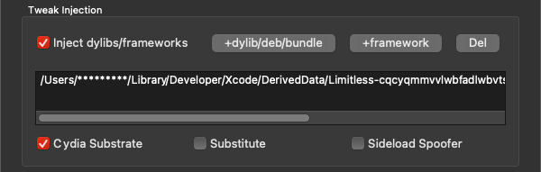

# Limitless
An iOS framework that crashes the app it is injected after a selected time (3,5,10 minutes).

## Compatibility
Any iOS/iPadOS device running iOS 9 or later, injectable in any app. Be aware about sideloading protection tho.

## Usage
To inject Limitless, you can use tools like [Sideloadly](https://sideloadly.io/) if you have a PC, or any other iPA installer that supports frameworks/tweak injection:

### Sideloadly Process: (Framework)

1. Download the IPA of an application.
2. Download the latest release of Limitless: [here](https://github.com/cranci1/Limitless/releases).
3. Extract the downloaded .zip file.
4. Open Sideloadly and select the iPA to install.
5. Click on "Advanced Options".
6. Check the "Inject dylibs/frameworks" option.
7. Click on "+framework" and drag Limitless.framework.
8. Now you can sideload your app with Limitless integrated.

### Sideloadly Process: (Tweak)

1. Download the IPA of an application.
2. Download the latest release of Limitless in the .deb format: [here](https://github.com/cranci1/Limitless/releases).
3. Open Sideloadly and select the iPA to install.
4. Click on "Advanced Options".
5. Check the "Inject dylibs/frameworks" option.
6. Click on "+dylib/deb/bundle" and drag the .deb file downloaded in step 2.
7. Now you can sideload your app with Limitless integrated.

## Why?
Honestly, I don't know either. I created this to see if it would cure my Instagram Reels addiction. And also, I wanted to create an iOS framework for the first time, and this was pretty simple to make.
